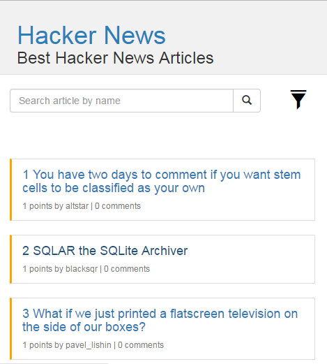
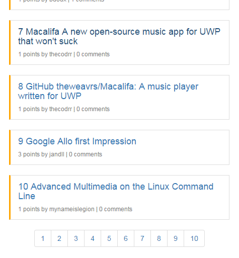
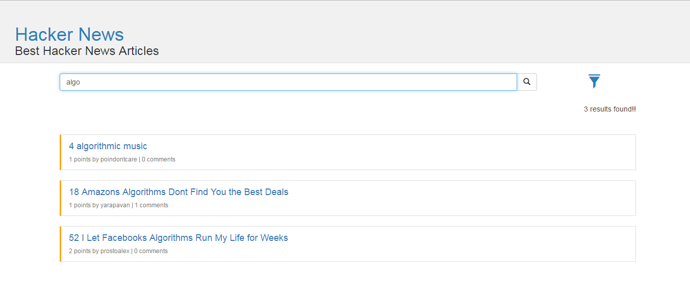

[Problem Statement]

Develop a pseudo front end application which would let the users help list and browse top Hacker News articles conveniently.

[Minimum Requirement]

— Use of Web API to fetch news details.

Utilise Response Parameters:

[ id,title, url, num_points, num_comments, author, created_at ].

Implement functionality to list articles in a web page.

— Visually interactive responsive design listing all the articles.

— Submit Screenshot, Source code & Instructions.

[Plus Point]

— A feature to Search (via name).

— Implement Sort feature (to filter result through ‘number of points’ in ascending and descending order).

— href url parameter.(Should open in new window | target="_blank")

[Extra Work]

— Implement feature to sort articles based on dates/time.(Sort based on old-to-new and new-to-old).

— Add autocomplete feature to Search articles conveniently .

— Custom elegant design, fonts and icons to make web app more user-friendly.

— You may add portfolio activity comprising awesome work you have done on web application(s).

— Use your imagination and add features which would make things easier for end users.

Technology Used:
 
 1. HTML 
 2. CSS 
 3. JavaScript 
 4. AJAX 
 5. Bootstrap  
 
Requirement for running the code : Chrome or firefox browser
 
 

